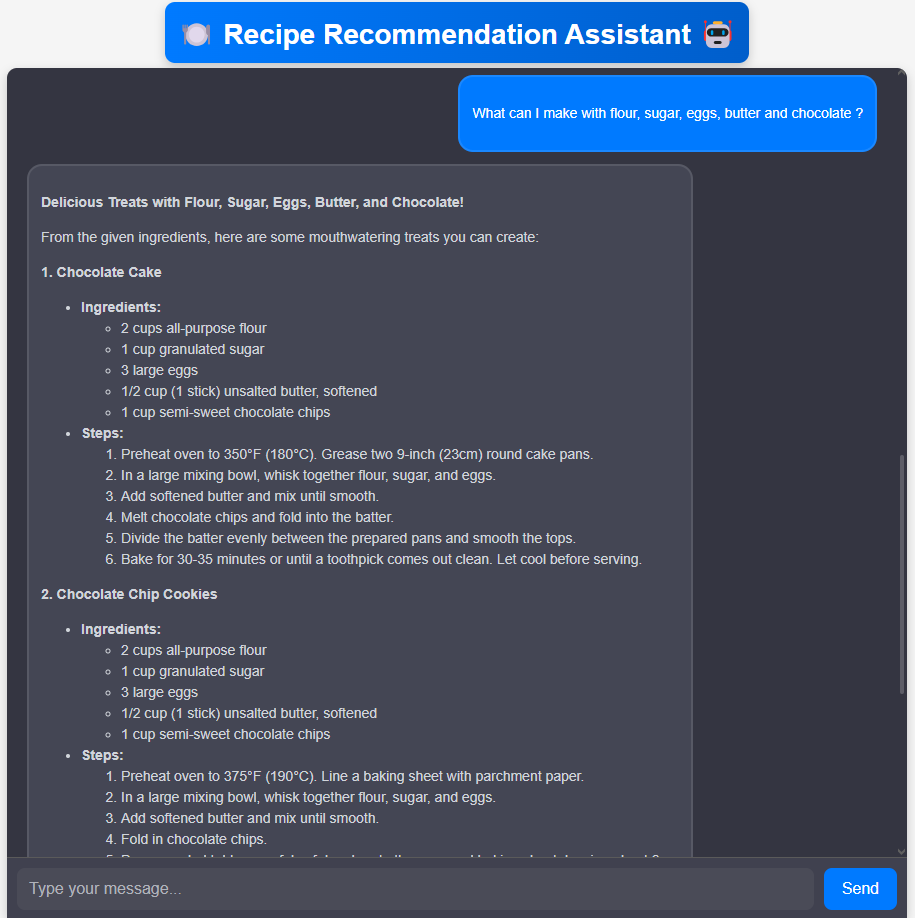
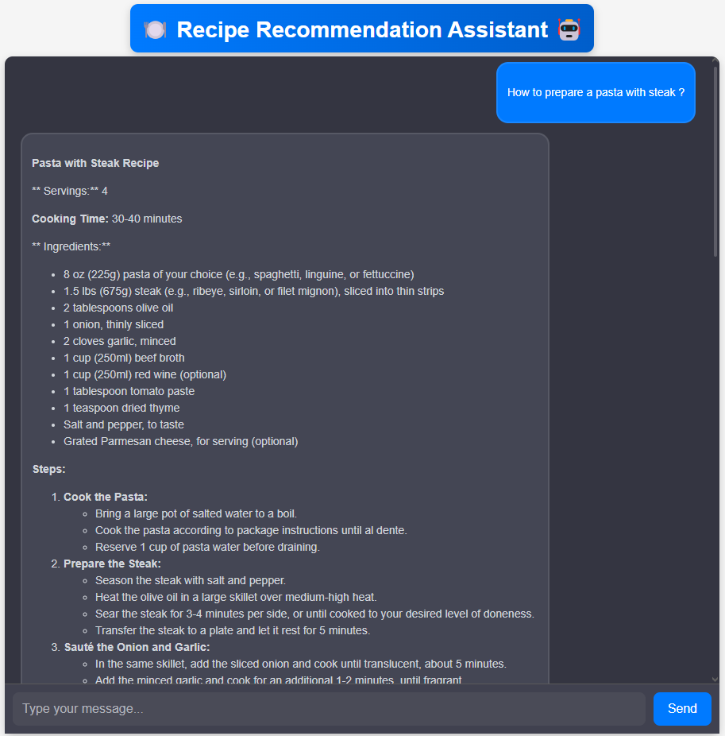

# 🍽️ Recipe Chatbot

## 📌 Overview
The **Recipe Recommendation Assistant** is an Agentic RAG-powered web application that looks for specific recipes and suggests recipes based on user-provided ingredients. It features a chatbot interface for interactive queries and uses AI-powered retrieval and generation techniques to suggest recipes.

The project is divided into two main components:

- **🖥️ Backend (`assistant-chat`)**: Built with Flask, it handles user queries, retrieves relevant recipes, and generates responses.
- **🌐 Frontend (`recipe-chatbot`)**: Developed with React, it provides a user-friendly chat interface.

## ✨ Features
✅ Interactive chatbot for recipe suggestions  
✅ Ingredient-based recipe search  
✅ Web search fallback for additional recipes  
✅ AI-driven response generation  

## 📁 Project Structure

```
📂 recipe-chatbot  # Frontend (React)
  ├── src/
  ├── public/
  ├── package-lock.json
  ├── package.json

📂 assistant-chat  # Backend (Flask)
  ├── .__init__.py
  ├── app.py
  ├── config.py
  ├── retrieval.py
  ├── grading.py
  ├── main.py
  ├── models.py
  ├── render.yaml
  ├── utils.py
  ├── workflow.py
  ├── requirements.txt
```

## 🚀 Installation & Setup

### 1. Clone the Repository
```bash
git clone https://github.com/Ghouma-workspace/Recipe-Recommendation-Chatbot
cd recipe-recommendation-assistant
```

### 🔧 Backend Setup
1. Navigate to the `assistant-chat` directory:
   ```bash
   cd assistant-chat
   ```
2. Create a virtual environment and install dependencies:
   ```bash
   python -m venv venv  
   source venv/bin/activate
   pip install -r requirements.txt
   ```
3. Run the Flask server:
   ```bash
   python app.py
   ```
   or
   ```bash
   flask run
   ```

### 🎨 Frontend Setup
1. Navigate to the `recipe-chatbot` directory:
   ```bash
   cd recipe-chatbot
   ```
2. Install dependencies:
   ```bash
   npm install
   ```
3. Start the React development server:
   ```bash
   npm start
   ```

## 🌍 Deployment

The project is configured for deployment on **Render (backend)** and **Netlify (frontend)**.

### 🚢 Deploy Backend (Render)
- Ensure the `requirements.txt` is updated.
- Use Render’s web service setup to deploy the Flask app.

### 🌎 Deploy Frontend (Netlify)
- Use `npm run build` to generate the production build.
- Deploy using Netlify’s drag-and-drop UI or CLI.

## 📸 Screenshots

### Example 1: User Providing Ingredients


### Example 2: Recipe Search



## 📜 License
This project is licensed under the MIT License. See the `LICENSE` file for more details.